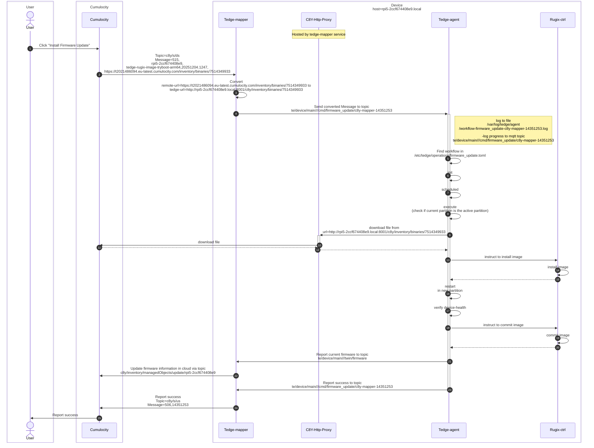
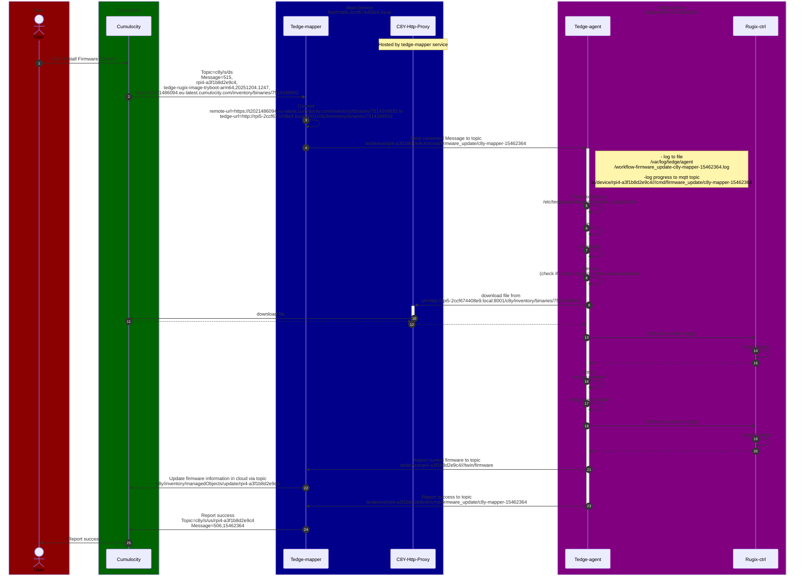

# Firmware Update on Main-Device

Note:

* Firmware Updates are highly individual and utilize the [User-defined operations workflows](https://thin-edge.github.io/thin-edge.io/references/agent/operation-workflow/). Below example is based on the Rugix firmware workflow in [meta-tedge](https://github.com/thin-edge/meta-tedge). 

* Below shows a successful firmware update. In case of a failed firmware-update, Rugix-Ctrl would do a rollback to previous Device Partition. Have a look at [this](https://github.com/thin-edge/meta-tedge/blob/kirkstone/meta-tedge-rugix/recipes-tedge/tedge-firmware-rugix/tedge-firmware-rugix/rugix_workflow.sh) file for process details. 

> All communication between Tedge-mapper/Tedge-agent & between Tedge-mapper/Cumulocity goes via an MQTT Broker hosted on the Device. This was abstracted for simplicity reasons.

# Firmware Update on Child-Device

Firmware Updates on a Child-Device are very similar than on the parent-/main Device. The difference in this scenario:

* the tedge-agent (running on child-device) listens to an MQTT Broker hosted on the Main Device. It listens to everything under `te/device/{child-id}/#`

* the tedge-mapper (running on main-device) sends the command to `te/device/{child-id}/#`

Further Notes:

* Firmware Updates are highly individual and utilize the [User-defined operations workflows](https://thin-edge.github.io/thin-edge.io/references/agent/operation-workflow/). Below example is based on the Rugix firmware workflow in [meta-tedge](https://github.com/thin-edge/meta-tedge). 

* Below shows a successful firmware update. In case of a failed firmware-update, Rugix-Ctrl would do a rollback to previous Device Partition. Have a look at [this](https://github.com/thin-edge/meta-tedge/blob/kirkstone/meta-tedge-rugix/recipes-tedge/tedge-firmware-rugix/tedge-firmware-rugix/rugix_workflow.sh) file for process details. 

> All communication between Tedge-mapper/Tedge-agent & between Tedge-mapper/Cumulocity goes via an MQTT Broker hosted on the Device. This was abstracted for simplicity reasons.

