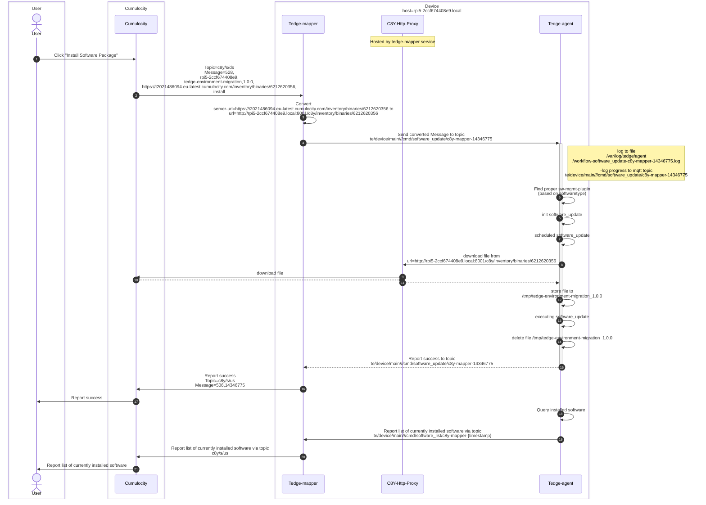
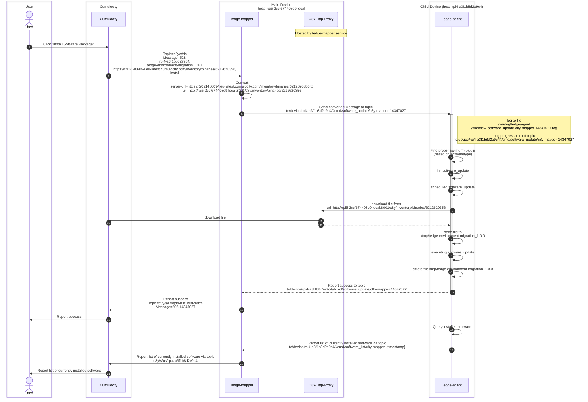

# Artifact in Cumulocity Software Repository

## Software Update on Main-Device

Device Setup:

* The tedge-agent (running on the) listens to a local MQTT Broker. It listens to everything under topic `te/device/main/#`

* The tedge-mapper sends the command to `te/device/main///cmd/#`

> All communication between Tedge-mapper/Tedge-agent & between Tedge-mapper/Cumulocity goes via an MQTT Broker hosted on the Device. This was abstracted for simplicity reasons.

## Software update on Child-Device

Software Updates on a Child-Device are very similar than on the parent-/main Device. The difference in this scenario:

* the tedge-agent (running on child-device) listens to an MQTT Broker hosted on the Main Device. It listens to everything under `te/device/{child-id}/#`

* the tedge-mapper (running on main-device) sends the command to `te/device/{child-id}/#`

> All communication between Tedge-mapper/Tedge-agent & between Tedge-mapper/Cumulocity goes via an MQTT Broker hosted on the Device. This was abstracted for simplicity reasons.

